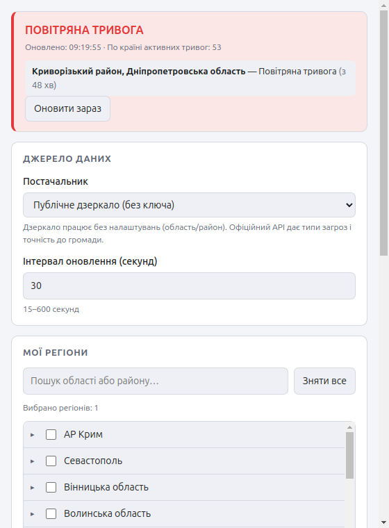

# Ukraine Alarm Tray

A cross-platform desktop tray app for Ukrainian air-raid alerts (drones and missiles).
Pick the oblasts and raions you care about and the tray icon tells you their status at a
glance — red during an alert, green when clear. Hover for the details.



## Features

- **Per-region subscriptions.** Choose any combination of oblasts, raions and (with the
  official API) hromadas. Selecting a region covers everything inside it.
- **Precision control.** Most Ukrainian alerts are declared oblast-wide. Turn off
  *Alert on oblast-wide alerts* and you are notified only when the alert names your own raion
  or city — not when some other part of the oblast is under threat.
- **All three sources at once.** Run the public mirror, api.ukrainealarm.com and alerts.in.ua
  together; an alert fires as soon as the *first* of them reports it, and one feed going down
  does not hide what the others can see. A health panel shows each feed's live state.
- **Knows what is inbound.** With alerts.in.ua enabled, the tray, notifications and window name
  the actual threat — drones, ballistic or cruise missiles, guided bombs — not just "air raid".
- **Red and yellow alert levels.** Ukraine declares two severities — yellow is a preliminary
  threat, red is a declared air-raid alert — and the app keeps them apart everywhere: the tray
  icon, the headline, the per-alert badge and the notification. A yellow threat also gets
  normal notification urgency instead of the critical urgency that makes a notification stick
  on screen until dismissed.
- **Colour-coded tray icon** — red on a red-level alert, amber on yellow, green when clear,
  grey when the status is unknown. Switchable to a single neutral icon if you would rather it
  never change.
- **Exact start times in your own timezone**, alongside the elapsed duration: `started
  16.09.2026, 09:14 (50 min)`. The duration is quick to read; the wall-clock time is what you
  can check against a news post or a message from someone else.
- **Hover details.** The tooltip lists every active alert: threat type, region, and how long
  it has been running. The same lines are mirrored into the tray menu (see
  [Linux tooltips](#linux-tooltips)).
- **Optional desktop notifications**, with a separate toggle for the all-clear.
- **Optional sound** — a siren on alert, a softer chime on all-clear, with a volume slider,
  a test button and a mute switch in the tray menu.
- **Tabbed, two-column settings** — Regions, Sources, Notifications, Appearance.
- **Ukrainian and English** interface. Ukrainian is the default.

## Install

### Ubuntu / Debian (recommended)

Download `ukrainealarm-tray-<version>-amd64.deb` from the
[Releases](https://github.com/Killerkiss/ukrainealarm-tray-app/releases) page, then:

```bash
sudo apt install ./ukrainealarm-tray-0.1.0-amd64.deb
```

Use `apt install ./file.deb` rather than `dpkg -i` so that apt pulls in the dependencies.
The app then appears in your application menu as **Ukraine Alarm Tray**.

To update, install the newer `.deb` over the top. To remove it:

```bash
sudo apt remove ukrainealarm-tray-app
```

Your settings live in `~/.config/Ukraine Alarm Tray/settings.json` and are left behind on
removal — delete that directory too for a clean uninstall.

### AppImage (any Linux, no root)

Useful for a machine where you would rather not install anything system-wide:

```bash
chmod +x ukrainealarm-tray-0.1.0-x86_64.AppImage
./ukrainealarm-tray-0.1.0-x86_64.AppImage
```

The AppImage is self-contained, so it does not create a menu entry by itself. If you want
one, [AppImageLauncher](https://github.com/TheAssassin/AppImageLauncher) will add it.

### If the tray icon does not appear

GNOME has no built-in tray. Install the indicator extension once per machine:

```bash
sudo apt install gnome-shell-extension-appindicator
```

Then log out and back in, and enable *AppIndicator and KStatusNotifierItem Support* in the
Extensions app. KDE, XFCE, Cinnamon and MATE need nothing extra.

### Build it yourself

```bash
git clone https://github.com/Killerkiss/ukrainealarm-tray-app.git
cd ukrainealarm-tray-app
npm install
npm start              # run from source
npm run package:linux  # writes .deb and .AppImage into release/
```

## Data sources

| | Public mirror (default) | api.ukrainealarm.com | alerts.in.ua |
|---|---|---|---|
| Credential | none | free API key | free app token |
| Granularity | oblast, raion | oblast, raion, hromada | oblast, raion, hromada, city |
| Alert types | air raid only | air raid, artillery, urban fighting, chemical, nuclear | same, plus `alert_level` |
| Alert level | **red / yellow** | not reported | **red / yellow** |
| **Threat detail** | — | — | **drones, ballistic, cruise missiles, guided bombs, MiG-31K…** |
| Region list | yes | yes | **no — alerts only** |

`alerts.in.ua` is the only source that says *what is actually inbound* rather than just "air
raid", so it is the one to enable if you want to tell a drone alert from a ballistic launch.
It publishes only active alerts and no region catalogue, so keep one of the other two enabled
to populate the region picker.

The app ships with the **public mirror** enabled, so it works the moment you launch it. The
other two need a free credential, entered in Settings → Sources:

- **api.ukrainealarm.com** — key from the [`@ukrainealarm_bot`](https://t.me/ukrainealarm_bot) Telegram bot.
- **alerts.in.ua** — token requested at [devs.alerts.in.ua](https://devs.alerts.in.ua/). Note their
  rate limit (12 requests/minute hard); the app sends conditional requests with
  `If-Modified-Since` and a 15s floor on the poll interval keeps it well inside that.

**Both can be enabled at the same time.** Results are merged: an alert reported by either
source raises the alarm, and when both report the same alert the earlier start time wins. If
one feed fails, the other keeps working and the failure is shown per-source rather than
blanking the app.

Each source numbers its regions differently, so the app derives a canonical key from the place
name (`ua:вінницька/вінницький`) and merges the two region trees onto it. That is what lets
one selection work across both feeds — see [`src/shared/regionKey.ts`](src/shared/regionKey.ts).

> This app reports what its data source reports. Treat it as a convenience, not as your
> primary warning system, and always follow official civil-defence guidance.

## Development

```bash
npm run dev        # Vite dev server + Electron, with main-process auto-restart
npm test           # unit tests (node:test, no framework)
npm run typecheck  # both tsconfigs
npm run build      # compile main + preload, bundle renderer
npm run package    # build an installer for the current platform
```

### Layout

```
src/main/       Electron main process: tray, polling, notifications, sound, settings
src/main/alerts/  pluggable data providers and the polling engine
src/preload/    the single contextBridge surface exposed to the renderer
src/renderer/   settings window (plain TypeScript + CSS, no framework)
src/shared/     types, i18n and settings validation used by both sides
scripts/        asset generators and the dev runner
```

### Generated assets

Tray icons and notification sounds are **generated**, not committed as opaque binaries:

```bash
npm run assets   # rewrites assets/icons and assets/sounds
```

`scripts/generate-icons.mjs` rasterises the warning-triangle mark into PNGs with a small
in-repo encoder (no `sharp`/`canvas` dependency), and `scripts/generate-sounds.mjs`
synthesises the siren and chime as WAV files. Edit the scripts, re-run, commit the result —
CI checks that the committed assets match what the scripts produce.

### Security posture

Context isolation is on, Node integration is off, and the renderer talks to the main process
through six explicit IPC channels. Settings arriving over IPC are re-validated in the main
process rather than trusted, and only `http(s)` URLs are ever handed to the OS handler.

## How severity is decided

A source that does not report a level (api.ukrainealarm.com) yields `unknown`, which is ranked
**as severe as red**, never as mild as yellow — an alert without a stated level is still a real
alert, and the tray must not understate it.

When two sources describe the same alert, a source that actually reports a level beats one that
does not, so a `yellow` from alerts.in.ua is not silently promoted to red just because another
feed also saw it. Between two known levels, the more severe wins. See
[`src/shared/alertLevel.ts`](src/shared/alertLevel.ts).

## Platform notes

### Linux tooltips

Tray tooltips are a Windows and macOS feature. Most Linux desktops use app indicators, which
have no hover event at all, so `setToolTip` does nothing there. The app therefore mirrors the
same detail lines into the top of the tray context menu — one click instead of a hover.

You may also need an indicator extension for the tray icon to appear on GNOME
(e.g. AppIndicator and KStatusNotifierItem Support).

### macOS

The app runs as a menu-bar app with no Dock icon (`LSUIElement`).

## License

MIT — see [LICENSE](LICENSE).
